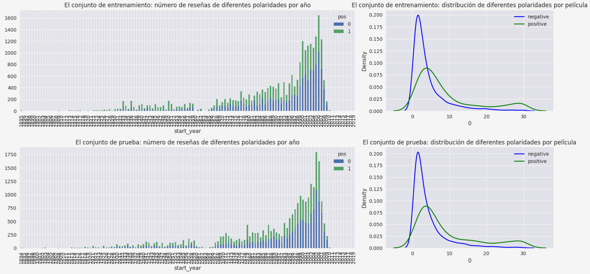
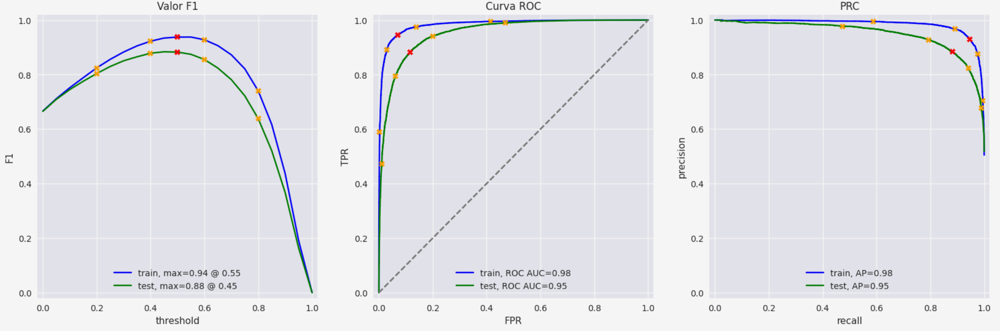

# Sistema de Clasificación Automática NLP (B2B)

## 1. Desafío Operativo (El Cuello de Botella)
En entornos B2B y Fintech, el procesamiento manual de textos no estructurados (tickets de soporte, *feedback* cualitativo, reportes de operaciones) consume gran parte del ancho de banda de los equipos. El objetivo de este proyecto fue diseñar un motor de *Natural Language Processing* (NLP) para clasificar automáticamente grandes volúmenes de texto con precisión humana, reduciendo tiempos de triaje y costos operativos asociados.

## 2. Ingeniería de Datos y Calidad (SFT & Evals)
Se procesó un corpus de texto crudo de más de 47,000 registros. Como paso crítico de control de calidad (*Evaluations*), se auditó la distribución estadística del dataset, confirmando un balance estructural perfecto (50.1% vs 49.9%) que garantiza la ausencia de sesgos algorítmicos en el entrenamiento. 

Adicionalmente, se aseguró una homogeneidad estadística absoluta entre los lotes de entrenamiento (*train*) y validación (*test*), paso esencial en entornos de *Supervised Fine-Tuning* (SFT) para asegurar robustez en producción.

## 3. Solución Técnica (NLP Pipeline)
Se construyó un *pipeline* industrial y escalable:
*   **Procesamiento y Vectorización:** Limpieza de datos (IQC), lematización y eliminación de ruido léxico, transformando el texto a representaciones matemáticas utilizando TF-IDF y aislando el entorno de pruebas para evitar Fuga de Datos (*Data Leakage*).
*   **Modelado Predictivo:** Entrenamiento algorítmico optimizando la frontera de decisión para clasificar la polaridad de los textos operativos.
*   **Impacto / Resultados:** El modelo superó el objetivo de negocio, alcanzando un **F1-Score de 0.8734** y un **ROC-AUC de 0.9455**, garantizando un equilibrio excelente entre Precisión y Recall para despliegue automatizado.

## 4. Stack Tecnológico
*   **Lenguaje:** Python 3
*   **Procesamiento NLP:** spaCy, NLTK
*   **Machine Learning:** Scikit-learn, Logistic Regression
*   **Persistencia:** Joblib (Listos para integración API)

### 💼 Business Impact & What I Would Do Next

Business Impact: Erradica el procesamiento manual de textos en la operación diaria, ahorrando horas de trabajo administrativo y reduciendo la fricción en la ruta de decisiones operativas.

Next Steps for Iteration: (1) Desplegar el modelo en un contenedor Docker con un endpoint (FastAPI) para que los sistemas ERP o CRM de la empresa puedan consumir la clasificación en tiempo real.
